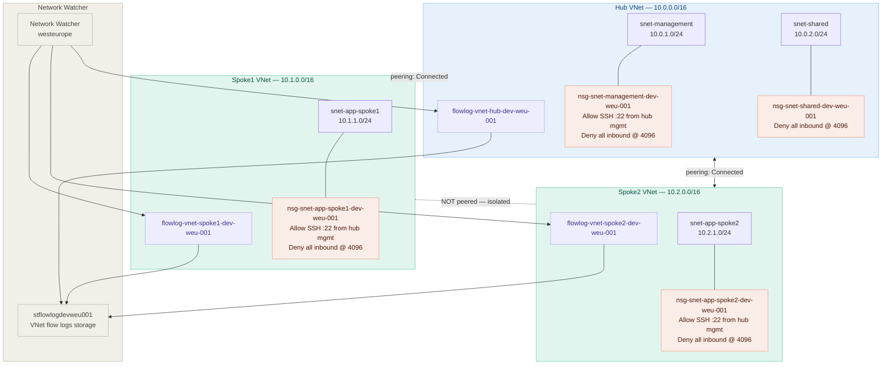

# Hub-spoke VNet topology — Project 3

## Overview
This project implements a Hub-spoke VNet topology, with Three VNets connected in hub-spoke pattern.
Hub contains shared services. Spokes are isolated workload networks.
Spoke-to-spoke traffic is blocked by design — must route via hub.

## Objectives
- Learn Hub and Spoke Topology
- Understand Vnet, Peering, NSG, Flow logs
- Practice real-world Azure networking

## Architecture




## Technologies Used
- Microsoft Azure
- VNET, Peering, NGS
- Azure CLI

## Variables
- link: https://github.com/salvador1996/AZ-P3-Vnet-Hub-Spoke-Topology/blob/main/p2-vars.sh


## Implementation Steps (look title **Variables**  for any "$VARIABLE")


- create a resource group **rg-network-dev-weu-001** : 
    + https://github.com/salvador1996/AZ-P3-Vnet-Hub-Spoke-Topology/blob/main/Screenshots/image-01-ResourceGroup-creation.JPG

- Build the hub VNet and spokes:
    ```bash
       az network vnet create \
          --name vnet-name \
          --resource-group "ResourceGroup" \
          --address-prefixes "HUB_PREFIX" \
          --location "LOCATION" \
          --tags Owner=yourname Environment=dev CostCenter=training Project=p3-network
    ```
    + https://github.com/salvador1996/AZ-P3-Vnet-Hub-Spoke-Topology/blob/main/Screenshots/image-03-Hub-vnet-creation.JPG

    ```bash
       az network vnet subnet create \
          --name snet-management-dev-weu-001 \
          --vnet-name vnet-hub-dev-weu-001 \
          --resource-group $RG \
          --address-prefix $HUB_MGMT_SUBNET
    ```
    + https://github.com/salvador1996/AZ-P3-Vnet-Hub-Spoke-Topology/blob/main/Screenshots/image-04-MGMT-Hub-Subnet-creation.JPG

    - verify all VNets exist: 
    ```bash
       az network vnet list \
          --resource-group "ResourceGroup" \
          -o table
    ```
    + https://github.com/salvador1996/AZ-P3-Vnet-Hub-Spoke-Topology/blob/main/Screenshots/image-05-all-vnet-created.JPG

- Configure VNet peering (hub-spoke connections):

    - peer hub to spokes (both directions):

        Hub --->  Spoke

            ```bash
               az network vnet peering create \
                  --name peer-hub-to-spoke \
                  --vnet-name "vnet-hub-name" \
                  --resource-group "ResourceGroup" \
                  --remote-vnet "VNET_SPOKE_ID" \
                  --allow-vnet-access true \
                  --allow-forwarded-traffic true
            ```
        Spoke --->  Hub

            ```bash
               az network vnet peering create \
                  --name peer-spoke-to-hub \
                  --vnet-name "vnet-spoke-name" \
                  --resource-group "ResourceGroup" \
                  --remote-vnet "VNET_HUB_ID" \
                  --allow-vnet-access true \
                  --allow-forwarded-traffic true
            ```

        + https://github.com/salvador1996/AZ-P3-Vnet-Hub-Spoke-Topology/blob/main/Screenshots/image-09-check-all-peering.JPG    

- Apply NSG rules — deny all, then allow explicitly:

   - Step 1 — create NSG for the hub management subnet:
        ```bash
           az network nsg create \
              --name nsg-management-dev-weu-001 \
              --resource-group "ResourceGroup" \
              --location "LOCATION" \
              --tags Owner=yourname Environment=dev CostCenter=training Project=p3-network
        ```
      - add the deny-all inbound rule (priority 4096):
        ```bash
           az network nsg rule create \
              --name DENY-ALL-INBOUND \
              --nsg-name "nsg-name-you-want-to-attach-this-rule-to" \
              --resource-group "ResourceGroup" \
              --priority 4096 \
              --direction Inbound \
              --access Deny \
              --protocol '*' \
              --source-address-prefixes '*' \
              --source-port-ranges '*' \
              --destination-address-prefixes '*' \
              --destination-port-ranges '*' \
              --description "Default deny all — everything must be explicitly allowed above this rule
        ```
        - allow SSH from hub management subnet only:
          ```bash
             az network nsg rule create \
              --name ALLOW-SSH-FROM-HUB-MGMT \
              --nsg-name nsg-name-you-want-to-attach-this-rule-to \
              --resource-group $RG \
              --priority 100 \
              --direction Inbound \
              --access Allow \
              --protocol Tcp \
              --source-address-prefixes $HUB_MGMT_SUBNET \
              --source-port-ranges '*' \
              --destination-address-prefixes '*' \
              --destination-port-ranges 22 \
              --description "Allow SSH from hub management subnet only"
        ```

        - allow SSH from hub management subnet only:
          ```bash
             az network nsg rule create \
              --name ALLOW-HTTPS-FROM-VNETS \
              --nsg-name nsg-management-dev-weu-001 \
              --resource-group $RG \
              --priority 200 \
              --direction Inbound \
              --access Allow \
              --protocol Tcp \
              --source-address-prefixes $HUB_PREFIX $SPOKE1_PREFIX $SPOKE2_PREFIX \
              --source-port-ranges '*' \
              --destination-address-prefixes '*' \
              --destination-port-ranges 443 \
              --description "Allow HTTPS from all VNets in the topology"
        ```

    - Step 2 — create NSG for spokes and apply same deny-all pattern:
        - Just create the nsg for the spokes just like the one on top.
        - Create the 2 rules for the spoke: **DENY-ALL-INBOUND** and **ALLOW-ALL-TRAFFIC-FROM-HUB-MGMT**

    - Step 3 — attach NSGs to subnets:
        ```bash
           az network vnet subnet update \
              --name "subnet-name" \
              --vnet-name "vnet-name" \
              --resource-group $RG \
              --network-security-group "nsg-name-you-want-to-attach"
        ```

    + https://github.com/salvador1996/AZ-P3-Vnet-Hub-Spoke-Topology/blob/main/screenshots/image-14-nsg-list.JPG 
    + https://github.com/salvador1996/AZ-P3-Vnet-Hub-Spoke-Topology/blob/main/screenshots/image-15-nsg-rule-list.JPG
    + https://github.com/salvador1996/AZ-P3-Vnet-Hub-Spoke-Topology/blob/main/screenshots/image-16-attach-nsg-to-subnets.JPG
    + https://github.com/salvador1996/AZ-P3-Vnet-Hub-Spoke-Topology/blob/main/screenshots/image-17-attachement-verification.JPG

- Write and Assign a custom role **VM restart role** :
    --> https://github.com/salvador1996/AZ-P3-Vnet-Hub-Spoke-Topology/blob/main/vm-restart-role.json

    + Replace the placeholder with your real subscription ID
      ```bash
        sed -i "s/PLACEHOLDER/$SUBSCRIPTION_ID/" vm-restart-role.json
      ```

    + Create the custom role
      ```bash
        az role definition create --role-definition vm-restart-role.json
      ```

    + Assign it to the USER
        ```bash
            az role assignment create \
              --assignee "USER_ID" \
              --role "VM Restart Operator" \
              --scope "SCOPE"
        ```
        + https://github.com/salvador1996/AZ-P3-Vnet-Hub-Spoke-Topology/blob/main/screenshots/image-09-all-user-and-roles.JPG
        + https://github.com/salvador1996/AZ-P3-Vnet-Hub-Spoke-Topology/blob/main/screenshots/image-10-OPS_USER-Roles.JPG

- Enable VNet flow logs and verify with Network Watcher:
    
    - Step 1 — enable Network Watcher for your region:
        ```bash
            az network watcher list \
              --query "[?location=='westeurope'].{Name:name, State:provisioningState}" \
              --output table
        ```
        - If it doesn't exist, create it:
          ```bash
            az network watcher configure \
              --resource-group $RG \
              --locations $LOCATION \
              --enabled true
          ```
    - Step 2 — create a storage account for flow logs:
        ```bash
            az storage account create \
              --name $STORAGE_NAME \
              --resource-group $RG \
              --location $LOCATION \
              --sku Standard_LRS \
              --kind StorageV2 \
              --tags Owner=yourname Environment=dev CostCenter=training Project=p3-network
        ```
    - Step 3 — Create VNet flow-logs for spokes and Hub:
        ```bash
            az network watcher flow-log create \
              --name flowlog-vnet \
              --resource-group $RG \
              --vnet $VNET_ID \
              --storage-account $STORAGE_ID \
              --location $LOCATION \
              --enabled true \
              --format JSON \
              --log-version 2 \
              --retention 7
        ```

    + https://github.com/salvador1996/AZ-P3-Vnet-Hub-Spoke-Topology/blob/main/screenshots/image-21-network-watcher-flow-log-list.JPG
    

## MY LEARNING JOURNEY

### AZ-P3-Vnet-Hub-Spoke-Topology - Troubles & Solutions (My Learning Journey)

This section documents the problems I ran into while learning, and how I solved them. 
I'm a beginner, so this is written from that perspective — I'm sharing it in case it helps someone else learning the same way.

#### 1. Hub and Spoke Topology & NSG-structure

 - Problem:
    I had problem for structuring everything in my head with the creation of "nsg", the "nsg-rule" and the attachment between them and the "Vnet". it tooks time to figure it out a little. 

 - Resolution:
   I asked AI to give 2 image with the structure of Azure-netwok:
  + https://github.com/salvador1996/AZ-P3-Vnet-Hub-Spoke-Topology/blob/main/screenshots/Hub-and-Spoke-Technology.JPG
  + https://github.com/salvador1996/AZ-P3-Vnet-Hub-Spoke-Topology/blob/main/screenshots/Network-Architecture-Azure.PNG

### 2. NSG-flow-log retirement & IP flow verify to test NSG rules

 - Problem:
    When i created my flow-log, i have done it at the NSG-scope, but it didn't work. i was left with a long message from Azure about the NSG-flow-log retirement. And since i don't have a Virtual machine yet, i cannot test the the IP flow to test my NSG-rules for now.

    + https://github.com/salvador1996/AZ-P3-Vnet-Hub-Spoke-Topology/blob/main/screenshots/image-19-problem-flowlog-creation.JPG

 - Resolution:
    I created the flow-log at the Vnet-scope. 

    + https://github.com/salvador1996/AZ-P3-Vnet-Hub-Spoke-Topology/blob/main/screenshots/image-20-flowlog-vnet-creation.JPG

## What I Learned

- Hub and Spoke Topology
- Subnet: it is different from the traditional one (with 5 occupied addresses)
- Vnet
- Peering: we do both directions and it is not transitive(spoke1 cannot reach spoke2 directly)
- NSG


## About Me

I am an "IT-Systemelektroniker" trainee in Cologne aiming to become a Cloud Engineer by 2029. I am new to Cloud Computing
and i choose to learn Azure first. I like to learn by doing projects instead of looking at videos or reading tutorials.
This Project is my very third project and i plan to do others projects to continue my learning and improve my skill. 